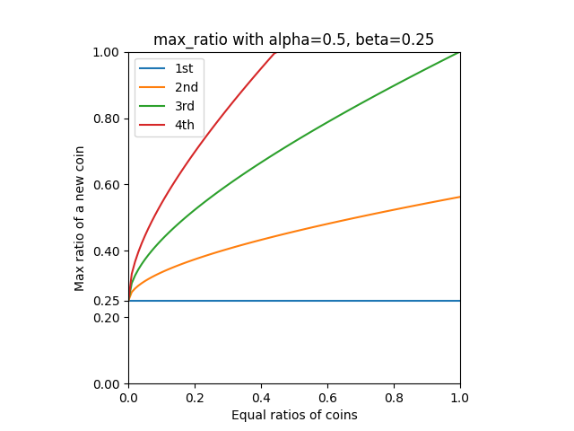

# About
I split the functionality into `PegKeeperRegulator` and `PegKeeperV2`.
Regulator supervises prices and other parameters telling whether Keeper is allowed to perform.
Keepers use funds according to regulations.
Both contracts can be superseded by the DAO, though should be reported of each other to act.

__Note.__
These checks are about protection against attacks and depegs, which are hard to distinguish from price fluctuations.
Any price decline can be considered as depeg, so some extents needed to identify suspicious behaviour.


# Spam attack
## Problem
First version of `PegKeeper` can be banned from pegging by sandwiching update call.
```
Move price close to 1
PegKeeper.update() will use a tiny amount of money
Move price back
<Action delay forbids updates for 15 minutes>
```
This is highly costly for the attacker, generating a lot of revenue in fees for LP.
Though, needs to be fixed to make protocol more resilient.

## Solution
Simple solution is to use StableSwap's `.price_oracle()` to see if current price is too far,
thus allowing to peg only when the price is more or less stable(or to force bots to move price to current oracle's).

## Deviation
We need to derive bounds for such deviation.

### Properties
1) small enough, so spam does not work unless it's pegged
2) big enough, so usually it works (no need for sandwich => less fee and gas)

### Calculation
Values around 1, when all coins are more or less pegged, relative and absolute error are roughly equal.
At other points, for most cases difference is tiny, at most few %.
For higher changes like 0.8 PegKeeper is most probably already drained or locked.
Taking into consideration huge peg amount with proportionate profit
leads it to be profitable even with sandwich taking current price close to oracle.
Summarizing, I see no reason to handle this cases, and I used absolute error saving a bit of gas.

1. Peg becomes callable at price around $1 - fee$, this is theoretical minimum where attacker can move it.
We need to define some bound for when we say that coin is pegged.
According to [experiments](#peg-price), actual price where the peg is enacted goes down to $ 0.9991$.
Let the bound be $max\\_deviation = 0.001$.

```math
deviation \le max\_deviation - fee
```

__Note.__
For the interval (1, 0.999) peg amounts increase almost linearly,
hence total liquidity throughput goes down $\left( 1 - \frac{deviation}{max\\_deviation - fee} \right)^2$,
what equals to $\ge \left( \frac{3}{8} \right)^2 = 0.14$ at $deviation = 0.0005$

2. "Usually" corresponds to time-weighted deviation.
Here we are talking about difference between current price(`get_p`) and EMA price(`price_oracle`) with 10 minutes window.
As a less biased I went with 10-minute price delta(w.r.t. USD) and as a simple estimate used standard deviation.
Here, different price delta might be more suitable for EMA algorithm and
to increase "usually"-ness greater powers of deviation might be used.

```math
deviation \ge \sigma(|\Delta price|)
```

Standard deviations of [coin](std_dev.sql) and [deltas](std_diff_dev.sql) for last 6 months according to dune analytics:

| coin | std dev | std diff dev |
|------|:-------:|:------------:|
| USDT | 0.0007  |    0.0003    |       
| USDC | 0.0005  |    0.0003    |
| USDP | 0.0007  |    0.0005    |
| TUSD | 0.0013  |    0.0004    |

Taking all together:
```math
\sigma \le deviation \le max\_deviation - fee
```
Substitute:
```math
0.0005 \le deviation \le 0.0008
```

By result $deviation = 0.0005$ should work fine.

__Note.__
Using standard deviation of pegs it makes sense for the corner case being $0.0005 = 0.0007 - 0.0002$,
taking $max\\_deviation$ not from a thin air.


# Depeg
## Problem
In case of depeg of the coin Peg Keeper pegs to,
the whole limit might be drained moving the price of Stablecoin [down](depeg.md).
Relevant when the price goes below 1 (provide),
otherwise PegKeeper withdraws all the funds and Stablecoin is not exposed to peg.

## Solution
There is currently a workaround, which checks if the overall stablecoin price(from aggregator) corresponds with the peg.
This make a lot of sense and helps to mitigate such predicament to a first approximation.

### Posterior
Chainsecurity proposed a solution allowing only _top 3 out of 4_ Peg Keepers to work.

If the price of peg drops, `provide()` would be locked so crvUSD does not expose to it more.  
On the other hand, if it is only a fluctuation and peg price is 1,
there is an arbitrage opportunity and Peg Keeper for other pegs will strengthen all of them.
There is a gap between prices before the opportunity emerges,
so I added $0.0003$ absolute error trick according to [experiments](#arbitrage).
_Absolute_ error grows insignificantly when the price goes off peg.

I used oracle price for ranging because:
1) it is considered to be too hard to manipulate and rearrange,
though will take some time to follow depeg that should finely correspond with PegKeeper's `ACTION_DELAY` = 15 min
2) cheaper in gas

### Anterior
Pegging should work more or less similar for different coins,
e.g. if Stablecoin price is going up it should do so against different coins, not only one.
Hence, we can limit debt relative to others, protecting exposure _before_ depeg happened.  
First we need to define trend as statistic of debts and derive the limit from it.

Debt limits already set by the DAO represent risks including liquidity associated with coins.
Hence, somewhat ideal situation can be defined as equality of $r = \frac{debt}{limit}$ for all coins.

Properties of $max\\_ratio(debt_0, debt_1, ..., debt_n)$:
1) Monotonically grow and symmetric w.r.t. debts from common sense
2) Concave,
situation when 1 peg keeper has debt $x$ is worse in terms of $max\\_ratio$ than 4 peg keepers with debts $\frac{x}{4}$
3) Definable corner cases gaps like all are zero or for the whole amount.

I came up with an equation $\sqrt{max\\_ratio} = a + b \cdot \sum_{i} \sqrt{r_i}$.
We can solve it for basic values:
1) One PegKeeper can use up to $r = \frac{1}{4}$
2) Three PegKeepers can use in limit whole $r = 1$

```math
\begin{cases}
\left(\frac{a}{1 - b}\right)^2 = \frac{1}{4}\\
\frac{a}{1 - 3 \cdot b} = 1
\end{cases}\\
```
```math
\begin{cases}
a = \frac{2}{5}\\
b = \frac{1}{5}
\end{cases}
```

Formula assumes convergence through iterations, though we can return the final value loosening debt regulation:
```math
\begin{align}
max\_ratio &= \left( \frac{a + b \cdot \sum_{i \ne j} \sqrt{r_i}}{1 - b} \right)^2 \\
&= \left( \frac{a}{1 - b} + \frac{b}{1 - b} \cdot \sum_{i \ne j} \sqrt{r_i} \right)^2 \\
&= \left( \alpha + \beta \cdot \sum_{i \ne j} \sqrt{r_i} \right)^2
\end{align}
```
```math
\begin{cases}
\alpha = \frac{\frac{2}{5}}{1 - \frac{1}{5}} = \frac{1}{2}\\
\beta = \frac{\frac{1}{5}}{1 - \frac{1}{5}} = \frac{1}{4}
\end{cases}
```



# Appendices
## Peg price
Peg Keeper is callable at price below $1 - fee$ – theoretical peg price.
Though, profit should be over gas costs to be called by one.

Current PegKeeper call take around 300k gas.
Local tests show 160k gas for PegKeeper and 180k for PegKeeperV2.
Simple estimation is $300k + 180k - 160k = 320k gas$.
By result, $320k gas * 10 GWEI/gas * 1600 USD/ETH \approx 5 USD$.

Limits of prices when the call becomes profitable from [simulation](peg_keeper_call.py).

4M(lowest) and 30M(highest) TVL with 0.01% and 0.02% fees.

| gas(USD)  | 0.01 (4M) | 0.02 (4M) | 0.01 (30M) | 0.02 (30M) |
|-----------|:---------:|:---------:|:----------:|:----------:|
| 0         |  0.9999   |  0.9998   |   0.9999   |   0.9998   |
| 3         |  0.9995   |  0.9995   |   0.9998   |   0.9998   |
| 6         |  0.9994   |  0.9993   |   0.9997   |   0.9997   |
| 12        |  0.9991   |  0.9991   |   0.9996   |   0.9997   |
| 24        |  0.9987   |  0.9987   |   0.9995   |   0.9996   |
| 48        |  0.9981   |  0.9981   |   0.9993   |   0.9995   |

To conclude, theoretical estimate can be used for big pools, but small need adjustment like $0.9995 - fee$.

## Arbitrage
Swaps PegKeepers are using considered to be main sources of liquidity for respective pairs.
Therefore, we can estimate differences in prices as a sum of fees: when ask of one coincides with bid of another.
Along with peg price theoretical is $1 - fee_0 - (fee_0 + fee_1) = 1 - 2 \cdot fee_0 - fee_1$.
Having fees equal to `0.01%` and `0.02%` price difference go between `0.0002` and `0.0004` and
resulting peg price after arbitrage varies from `0.9997` to `0.9994`.

Though need to check if other expenses do not break theoretical estimation a lot.
They sum up from cost of peg price, transaction gas cost and portfolio management.
We can not estimate the last, but there is some knowledge about current transaction prices.

Chosen parameters:
4M TVL as smallest USDP and TUSD are for now, 0.01% and 0.02% fees used now.
For [simulation](arbitrage.py), I used arbitrage strategy `dx crvUSD -> dy USD0 -> dy USD1 -> dx' crvUSD`
counting profit in crvUSD and assuming 1:1 swap for `USD0 -> USD1`.
This is same as having a bank of `USD0` and `USD1` generating profit in crvUSD.
One arbitrage transaction is 209741 gas.
$209741 gas * 10 GWEI/gas * 1600 USD/ETH \approx 3.4 USD$ at a time of writing.

$1 - fee$ peg price:

| gas (USD) | 0.01 + 0.01 | 0.01 + 0.02 | 0.02 + 0.01 | 0.02 + 0.02 |
|-----------|:-----------:|:-----------:|:-----------:|:-----------:|
| 0         |   0.9997    |   0.9996    |   0.9995    |   0.9994    |
| 3         |   0.9996    |   0.9995    |   0.9994    |   0.9993    |
| 6         |   0.9996    |   0.9995    |   0.9994    |   0.9993    |
| 12        |   0.9995    |   0.9994    |   0.9993    |   0.9992    |
| 24        |   0.9995    |   0.9994    |   0.9993    |   0.9992    |
| 48        |   0.9994    |   0.9993    |   0.9992    |   0.9991    |

$0.9995 - fee$ peg price:

| gas (USD) | 0.01 + 0.01 | 0.01 + 0.02 | 0.02 + 0.01 | 0.02 + 0.02 |
|-----------|:-----------:|:-----------:|:-----------:|:-----------:|
| 0         |   0.9992    |   0.9991    |   0.9990    |   0.9989    |
| 3         |   0.9990    |   0.9989    |   0.9988    |   0.9987    |
| 6         |   0.9990    |   0.9989    |   0.9987    |   0.9986    |
| 12        |   0.9989    |   0.9987    |   0.9986    |   0.9985    |
| 24        |   0.9987    |   0.9986    |   0.9985    |   0.9984    |
| 48        |   0.9985    |   0.9984    |   0.9982    |   0.9981    |

Errors are around $0.0001$ and $0.0002$ for current gas prices.

To conclude, the difference is small enough to omit.


# Ways to look to
- Statistics of prices when the peg happens
- Can debt limits affect stablecoin rate?
