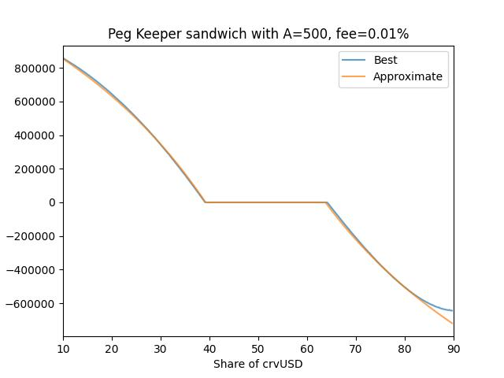
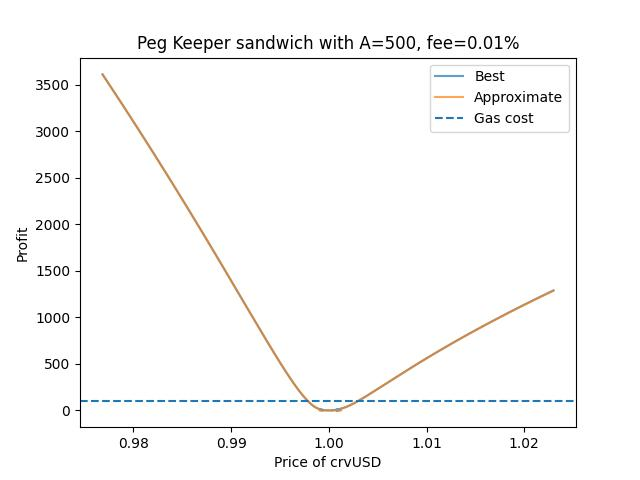

## About
crvUSD introduces a new mechanism for pegging the price to other stable coins with PegKeeper.
It provides and withdraws uncollateralized crvUSD in the pool if the price rises or decreases respectively.
The amount of the token is specified as $\frac{\delta x}{5}$.
Operation is atomic without any slippage checks, thence can be sandwiched.

## Algorithm
1. Make the pool more balanced by either providing or exchanging one of the tokens
2. Execute `PegKeeper.update()`
3. Return money spent in 1.

In result, you will do some work for PegKeeper and gain more profit than just executing.
Due to pool fees and gas it is reasonable to sandwich only if imbalance is big enough.

## Amount
For the most of the time it can be approximated by a simple line from ratio in the pool balances and liquidity depth!
```
share = crvUSD_balance / coin_balance
if share < 1:
    amount = D * (-399721741143539208 * share + 257754518881445707) // 10 ** 18
else:
    amount = D * (395673649873780890 / share - 224952787475105624) // 10 ** 18
```
Positive amount means adding crvUSD, negative for the other coin.






## Notice
All PegKeeper's operations are profitable from his point of view, so it can not lose money.
Though, it will lose some profit in favor of sandwicher and LPs in the form of fees.

Do not waste time trying to "hack" PegKeeper :)
